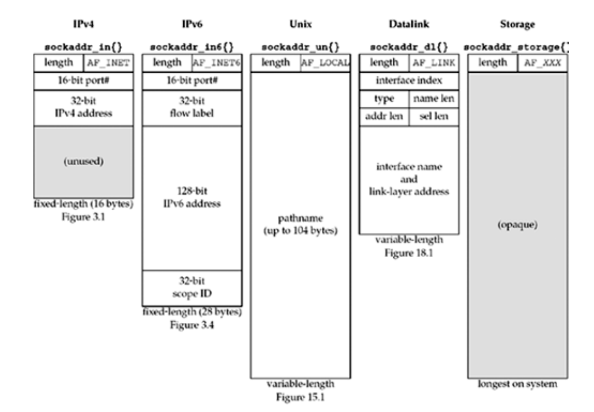

## Introduction

Socket API is one of the most important ones in network programming that must be known with greater understanding to develop efficient distributed networking applications. A socket address structure is defined for every socket by which we can communicate with the corresponding socket and also receive information from it. This address structure carries information such as IP address, port number, and family. We also discuss many address conversion functions that convert from text representation to binary structure that fits into the socket address structure.

There are many address conversion functions that do this independent of the type of the address: IPv4 or IPv6. In the next section, let's have a deep look at the socket address structure. 

## Socket Address Structures

Most functions require a pointer to the socket address as an argument to access the data in it. The names of the socket address always starts with the <i>sockaddr_</i>  and end with a suffix unique to the protocol suite.

Let's look at how the address structure looks for both IPv4 and IPv6.

### IPv4 Socket Address Structure

IPv4 socket address structure is also called the Internet socket address and is named as <i> sockaddr_in</i>. This address structure is included by adding the <netinet/in.h> header. POSIX definition of the socket address is defined below:


struct in_addr {
  in_addr_t     s_addr; // 32 bit network byte ordered IPv4 address.
}

struct sockaddr_in  {
  uint8_t           sin_len; //length of the structure is 16 bytes.
  sa_family_t       sin_family; //AF_INET.
  in_port_t         sin_port; // 16 bit TCP or UDP port number.
  struct in_addr    sin_addr; // 32 bit IPv4 address and it's network byte ordered.
  char              sin_zero[8]; // unused.
};




| # | Socket address attribute  | Memory needed     | 
|---|---------------------------|-------------------|
| 1 | sin_len                   | 1 byte(uint8_t)   |
| 2 | sin_family                | 1 byte(uint8_t)   | 
| 3 | sin_port                  | 2 bytes           |
| 4 | sin_addr                  | 4 bytes           |
| 5 | sin_zero                  | 8 bytes           |


Based on the above socket address structure, we can learn many important points on how the computer communication happens in the network of the computers. In this article, we consider everything based on the POSIX specification. 

The sin_len field won't be used in the definition of the socket address. It is only useful to handle the variable-length socket address structures. We never need it or never set it unless if we deal with the routing sockets. 

The POSIX specification requires only three members in the structure: sin_family, sin_port, sin_addr. All the implementations declare the sin_zero variable so that the socket address by minimum can be 16 bytes in size.

IPv4 address and the TCP or UDP port numbers were stored in the structure in the network byte order. This raises the question, why it's not in the host byte order? What is the difference between the host byte order and the network byte order? Let's answer all the above questions later and let's concentrate on the address structure.

The 32-bit IPv4 address can be accessed in two different ways. <i>serv.sin_addr</i> references the 32-bit IPv4 address in the in_addr structure, while serv.sin_addr.s_addr references the same IPv4 address in the in_addr_t. We need to be careful to know how we access the address when we pass an address to the function.

The sin_zero member is unused. We always set the sin_zero to 0. By rule, we must set the whole address structure to be initiated to 0 before using it. Socket address structure was used only on a given host. The structure is not used to communicate with the different host but just the IP address and the port number for communicating with the other devices. 

### Generic Socket Address Structure
 
Whenever we pass the socket address structure as a reference to the function, the function should be able to deal with the conversion of the socket address structure based on the protocol family upon which the address structure is created. To recieve the address in the function, we need a generic address structure that can be casted to protocol specific address inside the function. In ANSI C version just declaring void* is enough to get the socket address structure. But, the socket functions predate the ANSI C, generic socket address structure is a must.


struct sockaddr {
    uint8_t      sa_len;
    sa_family_t  sa_family;
    char         sa_data[14];
};


The above generic socket address structure resides in <sys/socket.h>.

Let's consider a function that gets a socket address structure as an argument as shown below:


int bind(int, struct sockaddr*, socklen_t);


The second argument of the above function requires socket address structure and it's declared and called below:


struct sockaddr_in serv;  //IPv4 socket address structure.

bind(sockfd, (struct sockaddr*)  &serv, sizeof(serv));


In the above declaration, an IPv4 specific socket address structure is converted to the generic socket address structure. If this conversion is not explicitly performed by the programmer, then the compiler generates the warning "warning: passing arg3 of 'bind' from incompatible pointer type. 

Inside the bind function implementation, sa_family value is checked to find what socket address structure is passed to it. In application programmer's point of view, generic socket address structure is to cast and send arguments to functions. In the kernel's point of view, generic socket address structure is recieved as an argument and it finds the sa_family value before casting it to the appropriate socket address structure.

### IPv6 Socket Address Structure 

The IPv6 socket address is defined in <netinet/in.h> header. The below code shows the socket address structure for IPv6:


struct in6_addr {
  uint8_t s6_addr[16];
}

struct sockaddr_in6 {
  uint8_t            sin6_len;     
  sa_family_t        sin6_family;
  in_port_t          sin6_port;
  
  uint32_t           sin6_flowinfo;
  struct in6_addr    sin6_addr;

  uint32_t           sin6_scope_id;
}



In this blog post, we won't go deep into the IPv6 address space but it's always good to know that it is there. A new generic socket address structure is defined as part of IPv6 API and it has the storage to accept any socket address structure values that the system supports.

The below code shows the struct declared for the sockaddr_storage. 



struct sockaddr_storage {
  uint8_t       ss_len;
  sa_family_t   ss_family;

  // Based on the implemenatation, we need to provide enough storage to hold any type of socket address.
}



## Conclusion

To conclude this article, I have posted a diagram from the book, "UNIX Network Programming, Volume 1" by Richard Stevens.  

